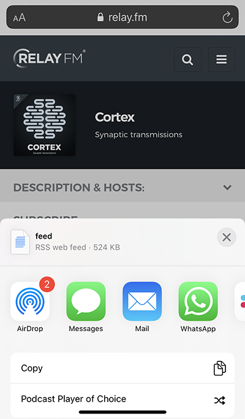

# Podcast Player of Choice iOS Shortcut

This iPhone [Shortcut](https://support.apple.com/en-ca/HT209055) uses the [https://ppoc.dev/](https://ppoc.dev/) API to open a podcast feed in your podcast player of choice.

The source for the ppoc.dev API is here: [github.com/will-head/ppoc](https://github.com/will-head/ppoc)

# Installation

Install the Shortcut by visiting the [Podcast Player of Choice share link](https://www.icloud.com/shortcuts/f8621e6c589f4f1bb957b2d16d526a21) on iOS device and follow the instructions.

# Steps

The following input feed formats are supported:
```
http://example.com/feed
https://example.com/feed
feed://example.com/feed
itpc://example.com/feed
podcast://example.com/feed
downcast://example.com/feed
pcast://example.com/feed

castro://subscribe/example.com/feed
pktc://subscribe/example.com/feed

overcast://x-callback-url/add?url=http%3A%2F%2Fexample.com%2Ffeed
```

The Shortcut prompts for a podcast feed if opened directly:  


It can also be used in the Share Sheet, by pressing and holding a podcast feed then selecting Share:  


The choosing the Podcast Player of Choice Shortcut:  


The Shortcut will prompt for which Podcast Player you want to use:  


It will then query the ppoc.dev API and then open the link in the player you chose (if it's installed):  


# Shortcut Source

The full Shortcut source is as follows:  


The data Request Body is as follows:  

